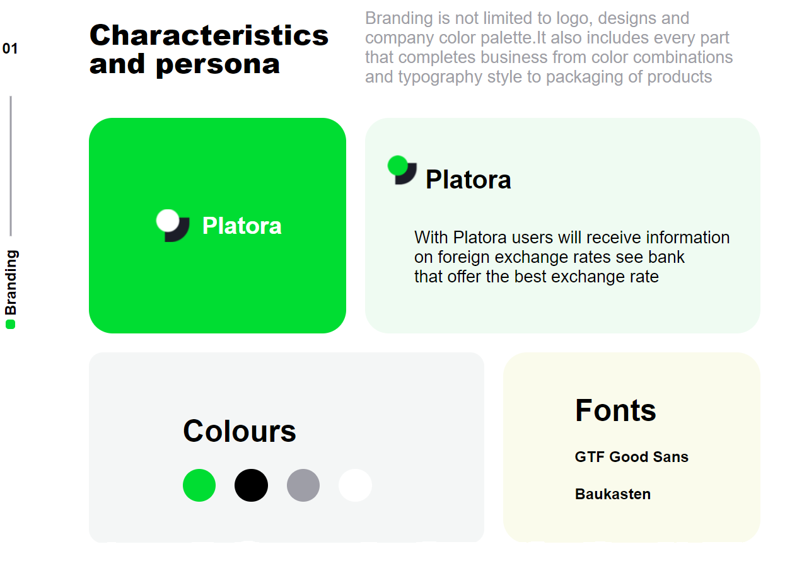

# Layout Replica challenge using Grid & Flexbox

  

## Description:woman_teacher:
The goal of the project is to replicate a given layout using Grid and flexbox.

## Installation:man_mechanic:
1. Clone this repository from GitHub
2. Open index.html in your browser.

## Technologies:man_technologist:
This project is built using:
- HTML,
- CSS.

## Demo:dancing_men:
Willing to see this project without cloning the repo? Follow the link below :point_down: 

https://layoutgridflexboxchallenge.netlify.app/

## Major learnings:woman_student:
- BEM methodology,
- Reset css,
- Normalize css,
- Deploying on Netlify

## Credit:clap:
[Designed by Prakhar Neel Sharma](https://dribbble.com/shots/14265057-Platora-branding-material-on-BEHANCE)

## Feedback  :see_no_evil::hear_no_evil::speak_no_evil: 
I'm still in a learning process of web development so feel free to shoot me an e-mail If you have any feedbacks/comments or any usefull things that could help me to keep improving :relaxed:.

:email: clara.chaouat@gmail.com
